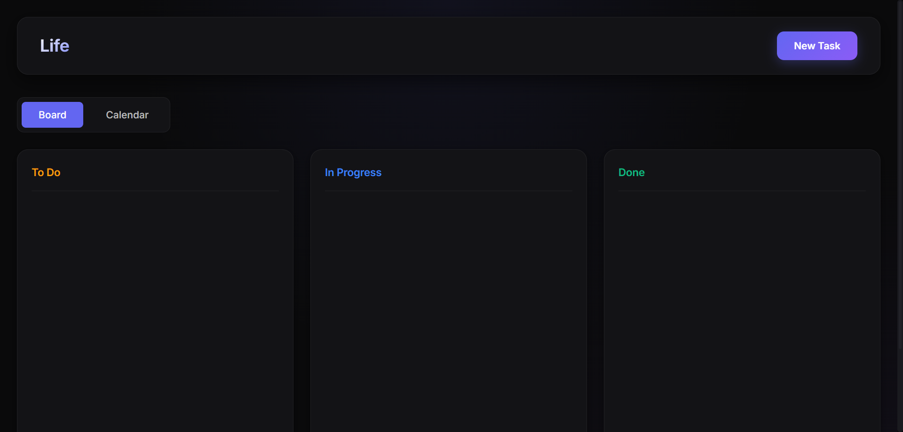
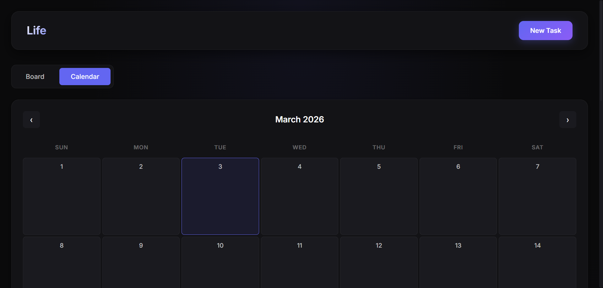
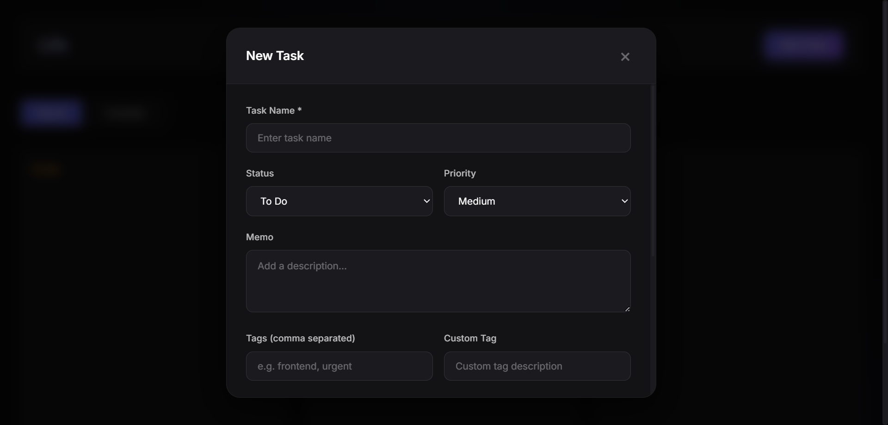

# Life - タスク管理ツール

シンプルかつ美しい看板方式（カンバン方式）のタスク管理ツール。ドラッグ&ドロップで直感的にタスクを管理できます。



## ✨ 特徴

### 📋 看板ボード
- **3つのカラム**: To Do / In Progress / Done
- **ドラッグ&ドロップ**: タスクをカラム間で移動して状態を変更
- **優先度表示**: 高（赤）/ 中（黄）/ 低（緑）で視覚的に把握

### 📅 カレンダービュー
- 月間カレンダーで予定を一目で確認
- タスクがある日はドットで表示
- 日付をクリックしてその日のタスクを表示



### 🏷️ タグ管理
- タグでタスクを分類
- オートコンプリート機能で過去のタグを再利用

### 🏀 ボール管理
- 誰が作業中か（ボールを持っているか）を可視化
- チームでのタスク管理に最適

### 💾 自動保存
- タスク変更時に自動でGitコミット＆プッシュ
- リモートリポジトリと同期でいつでもアクセス

### 🌙 ダークテーマ
- 目に優しいダークモード
- 洗練されたモダンデザイン

## 🚀 クイックスタート

### インストール

```bash
git clone https://github.com/your-username/task_and_memo.git
cd task_and_memo
```

### 起動

`start.bat` をダブルクリックするだけ：
- 仮想環境が自動作成されます
- 必要なパッケージが自動インストールされます
- ブラウザが自動で開きます

http://127.0.0.1:5000 にアクセス

## 📖 使い方

### タスクの作成



1. 「New Task」ボタンをクリック
2. タスク情報を入力
   - タスク名（必須）
   - 状態・重要度・メモ・タグ・締め切りなど

### タスクの状態変更

タスクカードをドラッグして、別のカラムにドロップするだけ。

### カレンダーで予定を確認

「Calendar」タブで月間予定を確認。日付をクリックで詳細表示。

## 📁 ファイル構成

```
task_and_memo/
├── app.py              # Flaskバックエンド
├── requirements.txt    # Python依存パッケージ
├── start.bat           # 起動バッチファイル
├── templates/
│   └── index.html      # HTMLテンプレート
├── static/
│   ├── style.css       # スタイルシート
│   └── app.js          # JavaScript
├── data/
│   ├── .git/           # データ用Gitリポジトリ
│   ├── tasks.json      # タスクデータ

├── docs/
│   ├── spec.md         # 仕様書
│   └── screenshots/    # スクリーンショット
└── README.md           # このファイル
```

## 💾 データ保存

タスクデータは `data/tasks.json` に保存され、変更時に自動的にGitにコミットされます。

### GitHub Pagesで公開

タスクをGitHub Pagesで公開・共有できます。

1. `data` ディレクトリでGitHubリポジトリを作成
2. GitHub Pagesの設定でSourceを `main` ブランチに設定

## 🎨 タスク項目

| 項目 | 説明 |
|------|------|
| タスク名 | タスクの名前（必須） |
| 状態 | To Do / In Progress / Done |
| 重要度 | High / Medium / Low |
| メモ | タスクの詳細説明 |
| タグ | カンマ区切りで複数入力可能 |
| 自由タグ | 自由形式のタグ情報 |
| ボール所持 | 作業中かどうかのフラグ |
| ボール保持者 | 担当者名 |
| 開始日 | タスク開始日 |
| 締め切り | タスク期限 |

## 🛠️ 開発環境

- **Python**: 3.11
- **Flask**: 3.1.0
- **フロントエンド**: HTML5 / CSS3 / JavaScript

## 📝 仕様書

詳細な仕様書は [docs/spec.md](docs/spec.md) を参照してください。

## 📄 ライセンス

MIT License

## 🤝 貢献

バグ報告や機能リクエストはIssueまでお願いします。

---

**Life** - シンプルで美しいタスク管理
